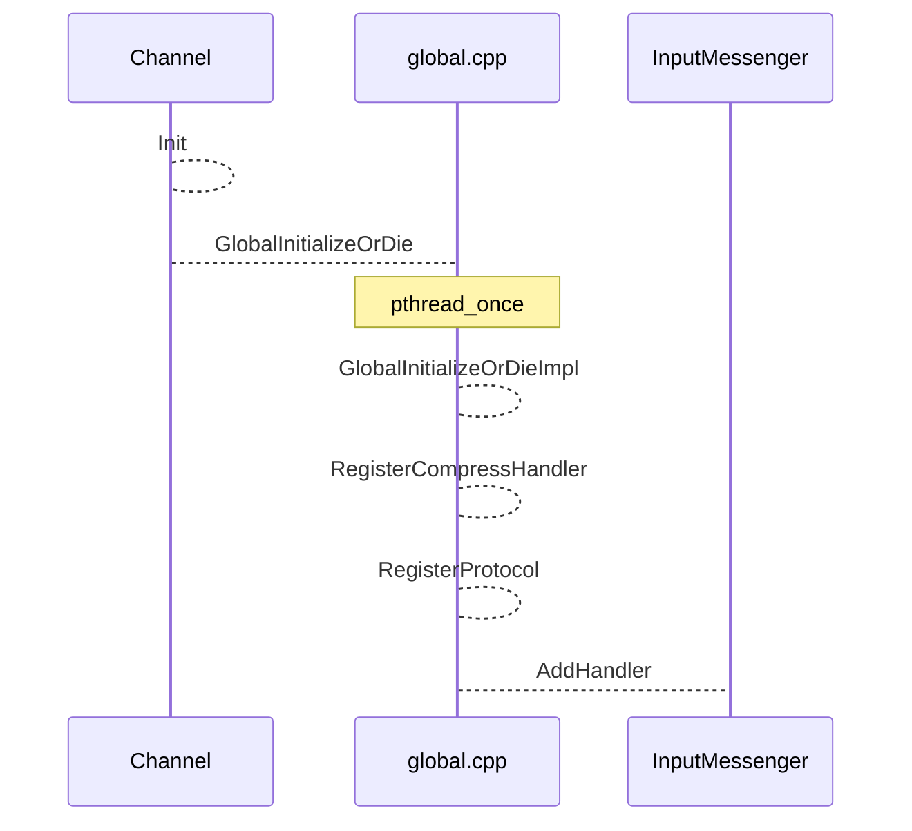
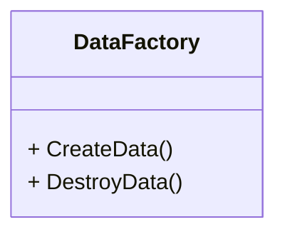

## 源码解析

### protocol

功能：协议handler注册.

#### 定义

```c++
struct Protocol {
    // [Required by both client and server]
    // The callback to cut a message from `source'.
    // Returned message will be passed to process_request and process_response
    // later and Destroy()-ed by InputMessenger.
    // Returns:
    //   MakeParseError(PARSE_ERROR_NOT_ENOUGH_DATA):
    //     `source' does not form a complete message yet.
    //   MakeParseError(PARSE_ERROR_TRY_OTHERS).
    //     `source' does not fit the protocol, the data should be tried by
    //     other protocols. If the data is definitely corrupted (e.g. magic 
    //     header matches but other fields are wrong), pop corrupted part
    //     from `source' before returning.
    //  MakeMessage(InputMessageBase*):
    //     The message is parsed successfully and cut from `source'.
    typedef ParseResult (*Parse)(butil::IOBuf* source, Socket *socket,
                                 bool read_eof, const void *arg);
    Parse parse;

    // [Required by client]
    // The callback to serialize `request' into `request_buf' which will be
    // packed into message by pack_request later. Called once for each RPC.
    // `cntl' provides additional data needed by some protocol (say HTTP).
    // Call cntl->SetFailed() on error.
    typedef void (*SerializeRequest)(
        butil::IOBuf* request_buf,
        Controller* cntl,
        const google::protobuf::Message* request);
    SerializeRequest serialize_request;
    
    // [Required by client]
    // The callback to pack `request_buf' into `iobuf_out' or `user_message_out'
    // Called before sending each request (including retries).
    // Remember to pack authentication information when `auth' is not NULL.
    // Call cntl->SetFailed() on error.
    typedef void (*PackRequest)(
        butil::IOBuf* iobuf_out,
        SocketMessage** user_message_out,
        uint64_t correlation_id,
        const google::protobuf::MethodDescriptor* method,
        Controller* controller,
        const butil::IOBuf& request_buf,
        const Authenticator* auth);
    PackRequest pack_request;

    // [Required by server]
    // The callback to handle request `msg' created by a successful parse().
    // `msg' must be Destroy()-ed when the processing is done. To make sure
    // Destroy() is always called, consider using DestroyingPtr<> defined in
    // destroyable.h
    // May be called in a different thread from parse().
    typedef void (*ProcessRequest)(InputMessageBase* msg);
    ProcessRequest process_request;

    // [Required by client]
    // The callback to handle response `msg' created by a successful parse().
    // `msg' must be Destroy()-ed when the processing is done. To make sure
    // Destroy() is always called, consider using DestroyingPtr<> defined in
    // destroyable.h
    // May be called in a different thread from parse().
    typedef void (*ProcessResponse)(InputMessageBase* msg);
    ProcessResponse process_response;

    // [Required by authenticating server]
    // The callback to verify authentication of this socket. Only called
    // on the first message that a socket receives. Can be NULL when 
    // authentication is not needed or this is the client side.
    // Returns true on successful authentication.
    typedef bool (*Verify)(const InputMessageBase* msg);
    Verify verify;

    // [Optional]
    // Convert `server_addr_and_port'(a parameter to Channel) to butil::EndPoint.
    typedef bool (*ParseServerAddress)(butil::EndPoint* out,
                                       const char* server_addr_and_port);
    ParseServerAddress parse_server_address;

    // [Optional] Customize method name.
    typedef const std::string& (*GetMethodName)(
        const google::protobuf::MethodDescriptor* method,
        const Controller*);
    GetMethodName get_method_name;

    // Bitwise-or of supported ConnectionType
    ConnectionType supported_connection_type;

    // Name of this protocol, must be string constant.
    const char* name;

    // True if this protocol is supported at client-side.
    bool support_client() const {
        return serialize_request && pack_request && process_response;
    }
    // True if this protocol is supported at server-side.
    bool support_server() const { return process_request; }
};
```


#### 扩展

实现对应的函数，在global.cpp中注册

```c++
// 3 steps to add a new Protocol:
// Step1: Add a new ProtocolType in src/brpc/options.proto
//        as identifier of the Protocol.
// Step2: Implement callbacks of struct `Protocol' in policy/ directory.
// Step3: Register the protocol in global.cpp using `RegisterProtocol'   

    Protocol baidu_protocol = { ParseRpcMessage,
                                SerializeRequestDefault, PackRpcRequest,
                                ProcessRpcRequest, ProcessRpcResponse,
                                VerifyRpcRequest, NULL, NULL,
                                CONNECTION_TYPE_ALL, "baidu_std" };
    if (RegisterProtocol(PROTOCOL_BAIDU_STD, baidu_protocol) != 0) {
        exit(1);
    }
```



### Server

#### AddService

```sequence

RPCImplServer --> Server:AddService
Server-->Server:AddServiceInternal
Server-->Service:GetDescriptor
Server-->	Server:InitializeOnce
Note over global.cpp:初始化protocal和compress handler
Server-->global.cpp:GlobalInitializeOrDie
Note over global.cpp:pthread_once
global.cpp -->global.cpp:GlobalInitializeOrDieImpl
global.cpp -->global.cpp:RegisterCompressHandler
global.cpp -->global.cpp:RegisterProtocol
global.cpp -->InputMessenger:AddHandler
Note over Server:check if service is registered
Server --> ServiceMap:seek(sd->name())
Note over Server: for method in sd->method(i)
Server --> MethodMap:register method use full name
Note over Server: end
Server -->ServiceMap: register service


```

#### Start

(一) 注册方法&创建Acceptor

```sequence
Server -->Server:Start
Server -->Server:StartInternal
Server-->Server:InitializeOnce
Server-->Server:AddCertificate
Server-->RestfulMap:PrepareForFinding
Server-->Bthread:bthread_setconcurrency
Server-->MethodStatus:SetConcurrencyLimiter
Server-->endpoint:tcp_listen
Server-->Server:BuildAcceptor
Note over Server:将配置白名单中protocol加到Acceptor，没有则加全部
Server-->Acceptor:AddHandler
Server-->Acceptor:StartAccept
Acceptor-->Acceptor:Initialize


```
（二）创建socket&注册Epoll
```sequence
Acceptor-->Bthread:bthread_start_background(CloseIdleConnections)
Acceptor-->Socket:Create
Note over butil:从资源池获取socket资源
Socket-->butil:get_resource 
Note over Socket:_on_edge_triggered_events=InputMessenger::OnNewConnections
Socket -->Socket:设置属性
Socket-->Socket:ResetFileDescriptor
Socket -->butil:get_local_side
Socket -->butil:make_close_on_exec
Socket -->butil:make_non_blocking
Socket -->butil:make_no_delay
Socket -->butil:setsockopt(SO_SNDBUF)
Socket -->butil:setsockopt(SO_RCVBUF)
Socket -->EventDispatcher:GetGlobalEventDispatcher
Socket-->EventDispatcher:AddConsumer(SocketId socket_id, int fd)
EventDispatcher-->Epoll:epoll_ctl
```

### Run


### 组件

#### DataFactory

给使用者提供threadlocal data接口




### IOBuf


### EventDispatcher

功能：封装Epool实现fd异步收发，启动bthread线程处理

pthread_once

```c++
// 保证函数只调用一次，保证静态对象只设置一次
static EventDispatcher* g_edisp = NULL;
static pthread_once_t g_edisp_once = PTHREAD_ONCE_INIT;
pthread_once(&g_edisp_once, InitializeGlobalDispatchers);
```


