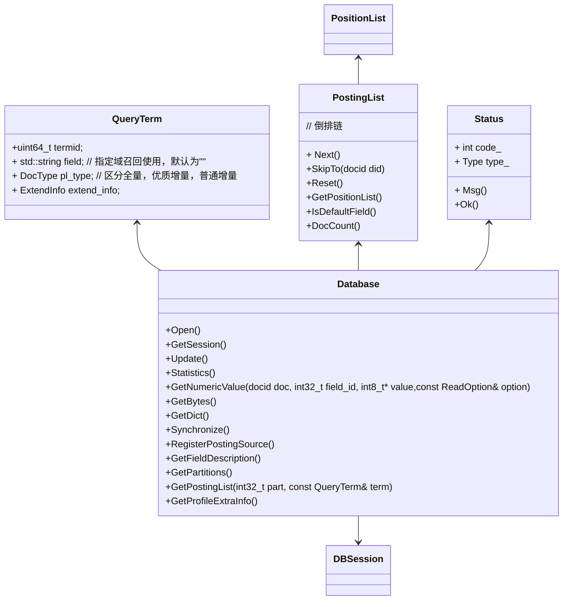
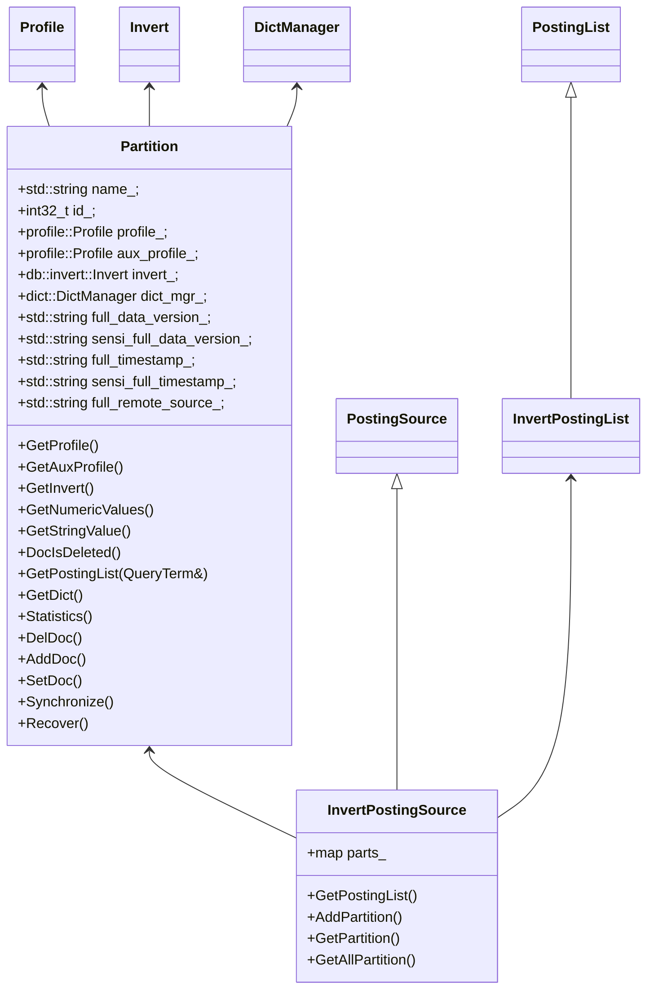
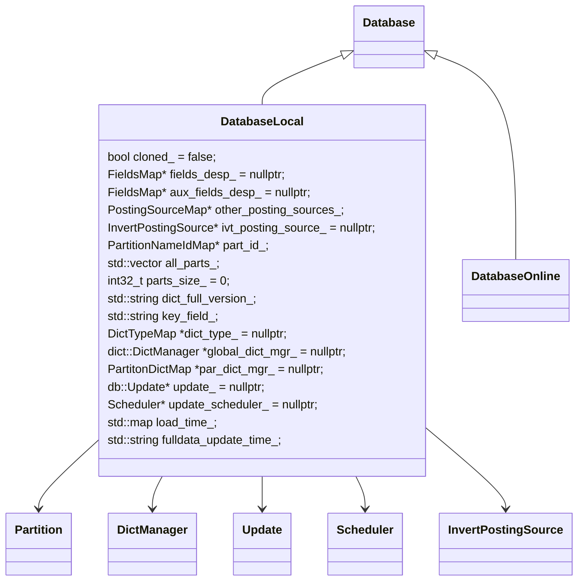
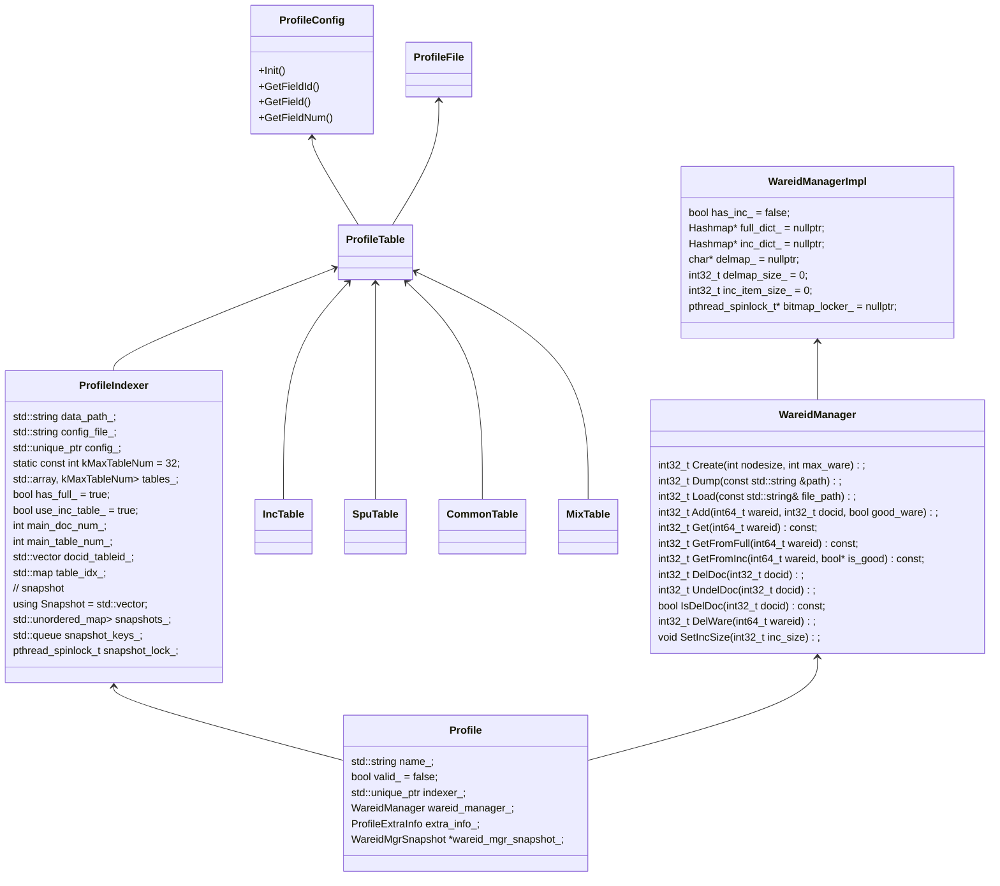
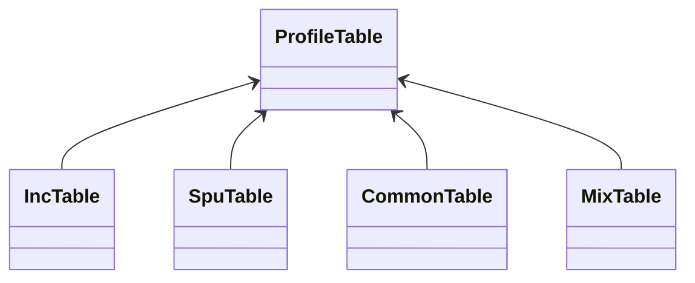
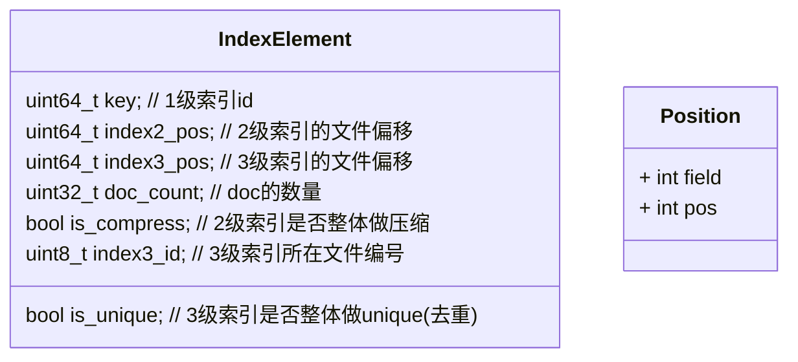
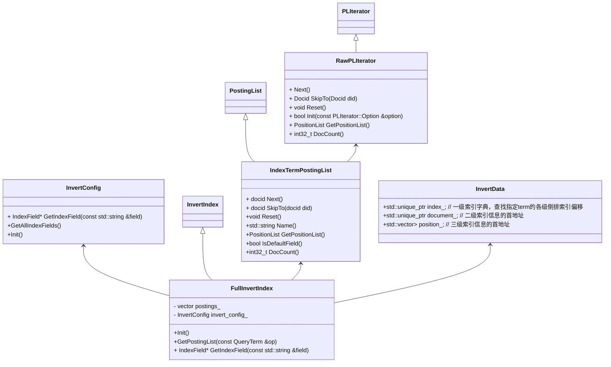

### module database

### Function

维护正排，倒排，业务字典三类数据


### APIS



### partition




###  Profile

正排表设计理念：

WareidManager维护（全量&增量）wareid->docid映射关系及删除docid位图

ProfieTable：维护正排数据表

表设计理念：

+ 字段类型包括普通定长字段，变长string及多值

+ 多文件存储每个文件记录条数不超过kDocNumPerSegment（1<<20)

+ 两种文件存储：

  main.idx.[0-9]:定长字段及变长字段header

  ext.idx.[0-9]]: 变长数据

  优点：main.idx中每条记录定长便于访问。将变长转换为定长
  
  ```c++
  // string header
  #pragma pack(1)
  struct ProfileStringHeader {
      uint8_t flag : 1;   // 0表示存的字符串原值; 1表示字符串偏移量
      uint16_t len : 15;  // 字符串长度
  };
  union ProfileStringOffset {
      int64_t int_value : 48;
      char str_value[6];  // 存储实际字符串(长度不超过6)
  };
  
  #pragma pack()
  struct ProfileString {
      ProfileStringHeader header;
      ProfileStringOffset offset;
  };
  // multivalue header
  #pragma pack(1)
  struct ProfileMultiInfo{
      uint8_t num;    // 多值个数, 如果num为0，代表空值
      int64_t pos : 56;  // 多值偏移
  };
  ```
  
  







invert index structure



三级索引结构

一级索引：

TermInvertIndexDict （InlineHashMap)

存放termid -->IndexElement 二三级索引信息及doc个数

二级索引：

| int32      | ...  | int32       |
| ---------- | ---- | ----------- |
| docid list |      | offset list |

三级索引：(多个文件）

count| Position list 




