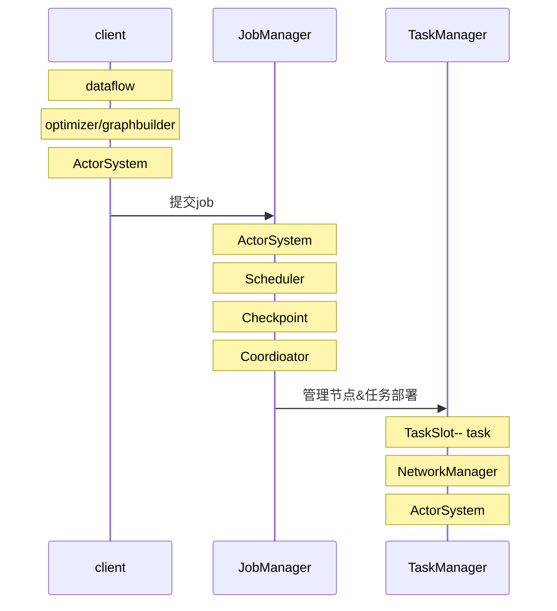

### Flink

#### 优势

+ 高吞吐，低延迟，高性能分布式流式数据处理框架

+ 支持事件时间

+ 状态计算

​       在流式计算过程中将算子的中间结果保存到内存或文件系统，等下个时间进入算子后从之前状态获取结果进行计算

+ 高度灵活的窗口操作

+ 轻量级分布式快照实现的容错

  预防异常情况，将状态信息checkpoint自动回复

+ 基于JVM实现独立内存管理

+ SavePoints

### 基本架构

+ 层

API&Library层， Runtime核心层及物理部署层

+ 模块

由JobManager,TaskManager两个组件组成，Master-Slave架构设计，通信通过Akka framework，JobManager多线程设计



JobManager:

负责集群任务调度和资源管理，从客户端获取提交的应用，根据集群中taskslot使用情况，分配资源。

TaskManager

负责具体任务执行和对应任务在每个节点的资源申请管理


### Flink编程接口

数据处理接口抽象成四层：

| 层                             | 功能介绍     |
| ------------------------------ | ------------ |
| SQL API                        | 高级语言     |
| TableAPI                       | 声明式API    |
| DataSteam&DataSet API          | 核心API      |
| Stateful stream processing API | 低级构建模块 |

TableAPI：加了schema信息

DataStream (流处理）& Dataset（批处理）【map, filter, joins,aggregation,window]

### 样例

```scala
package com.realtime.flink.streaming
import org.apache.flink.api.java.util.ParameterTool
import org.apache.flink.streaming.api.scala.{DataStream,StreamExecutionEnvironment, _}

object wordcount {
  def main(args : Array[String]) {
   	// 第一步 定义执行环境
    var env = StreamingExecutionEnvironment.getExecutionEnvironment
    // 第二步 设定数据源
    var text = env.readTextFile("file://path/file")
    // 第三步 对数据集指定转换操作
    var counts: DataStream[String Int] = text
    		                                 .flatMap(_.toLowerCase.split("\t")
                                         .filter(_.nonEmpty)
                                         .map((_, 1))
                                         .keyBy(0)
                                         .sum(1)
     // 第四步 指定计算结果输出位置
     if（params.has("output")) {
         counts.writeAsText(params.get("output"))
     } else {
         counts.print()
     }
     // 第五步 指定名称触发流式任务
     env.execute("streaming wordcount")
  } 
}
```


### DataStream API介绍和使用

+ 编程模型

DataSource模块

1. 内置数据源：文件，socket网络端,集合
2. 第三方数据源（Connector  kafka, ES,自定义数据源)

```scala
var text = env.readTextFile("/path/file")
var text = env.socketTextStream("localhost", 9000)
var dataStream = env.fromElements({1, 2, 3})
# 可以自定义schema
var input = env.addSource(new FlinkKafkaConsumer010<>(topic, new SimpleStringSchema,property)
wordStream.addSink(kafkaProducer)
```


Transformation模块

DataSink模块

### DataSteam API


Windows多流合并

Window join为inner-join. 包括tumbling window(滚动窗口）,slidingwidow（滑动窗口），session window(会话join），间隔关联（interval join)


### Dataset API

多表关联

OuterJoin包括left，right,full outer join


