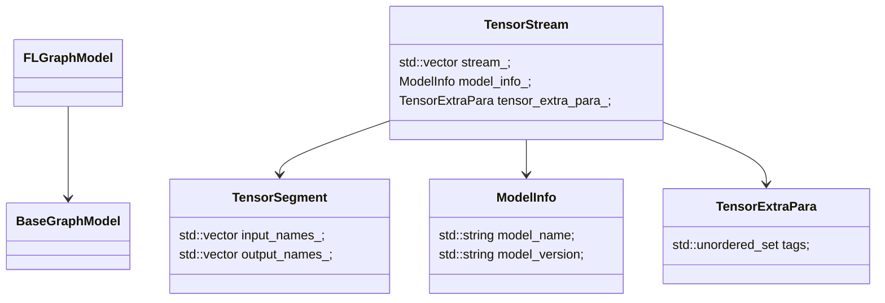

## 广告predictor源码解析



AutoUpdateDict

设计理念：

1. 自动检测更新
2. md5有效性检测
3. text or json格式加载
4. 反射机制

格式：

| id   | path | class_name | update_interval |
| ---- | ---- | ---------- | --------------- |
|      |      |            |                 |


```c++
  bthread::TimerThread* timer_thread_; // 定时器
  bthread::TimerThread::TaskId task_id_;  // task id
  std::string dict_file_path_;  // 字典文件路径
  bool is_running_;
  std::string md5_;
  std::string dict_id_;
```


#### 关键组件

+ 定时器

  ```c++
    
  timespec update_time = butil::seconds_from_now(update_interval_sec_);
  task_id_ = timer_thread_->schedule(AutoUpdateDict::Routine, this, update_time);
  ```

  