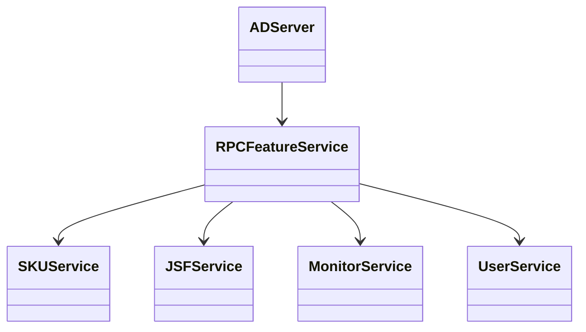
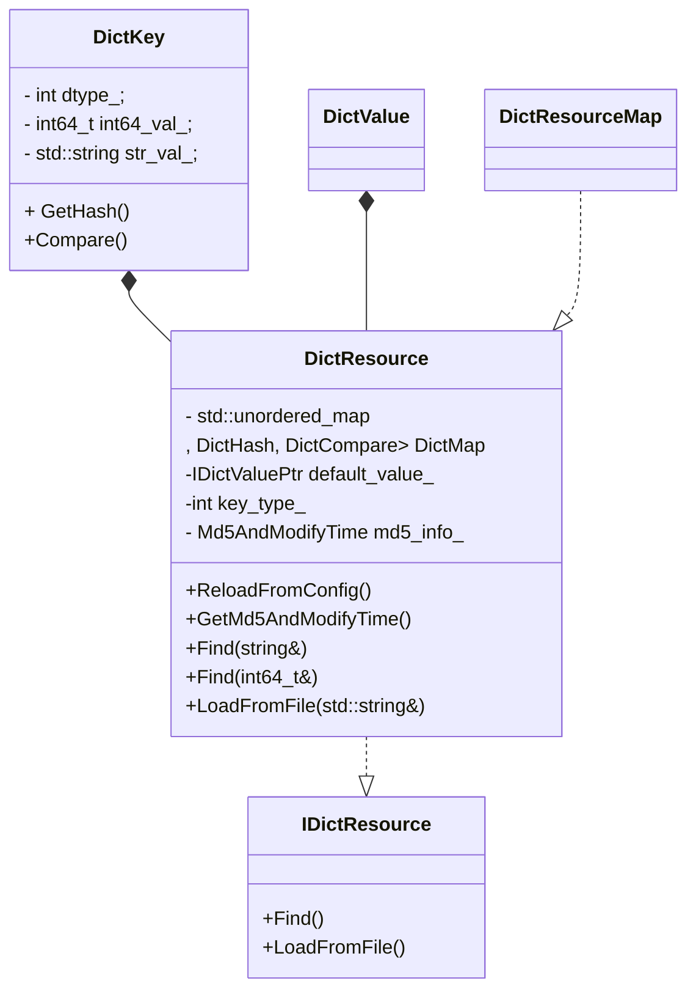

## rpc_feature_server

### Introduction

+ bazel 编译
+ brpc通信
+ ini配置文件
+ glog日志
+ jsf服务管理




### SKU Info design

```sequence
FeatueServer->AdSkuRedisLruCache: Get
AdSkuRedisLruCache -> AdSkuRedisLruCache:GetSkuCacheInfoFromCache
AdSkuRedisLruCache -> SKUService:GetSKUInfo

```
AdSkuRedisLruCache数据结构设计:
LRU cache -> ShardedMRUCache-> butil::HashingMRUCache
ShardedMRUCache是为了减少锁的并发访问开销

### Dict Resource



DictResource::LoadFromFile

格式：

 int64 or string\n

 dict_key\n + pb size + PB string + dict_key\n + pb size + PB string 


DictResourceMap：

+ 管理多个dict

+ ReloadDictResource  重新reload

### feature extraction

  

  ```mermaid
classDiagram
FeatureCollectorForPb --> FeatureCollector
FeatureCollectorForText --> FeatureCollector
FeatureCollectorForMapPB --> FeatureCollector
FeatureCollectorMgrForText --> FeatureCollectorForText
FeatureCollectorMgrForPb --> FeatureCollectorForPb
FeatureCollectorMgrForMapPb --> FeatureCollectorForMapPB
FeatureExtractor --> FeatureCollectorMgr
FeatureGenerator <-- FeatureExtractor
RedisDataAccessor  <-- FeatureExtractor
FeatureCollectorMgr <|-- FeatureCollectorMgrForMapPb
FeatureCollectorMgr <|-- FeatureCollectorMgrForText
FeatureCollectorMgr <|-- FeatureCollectorMgrForPb

class FeatureExtractor {
+ ParallelAdExtractFeatures()
}
class FeatureGenerator {
+GenerateCommonFeatures()

}
  ```

```sequence
FeatureServerService ->FeatureServerService:RpcService
FeatureServerService ->FeatureServerService:ProcessRequest
FeatureServerService ->MonitorHandler:AddQueryStat
FeatureServerService ->FeatureServerReq:cfg().model_id()
FeatureServerService ->FeatureServerConfig:GetFeatureList(model_id)
FeatureServerService ->FeatureServerConfig:GetSkuInfoType(model_id)
FeatureServerService ->FeatureServerConfig:GetMaterialInfoType(model_id)
FeatureServerService ->FeatureServerConfig:GetUserInfoType(model_id,user_info_set)
FeatureServerService ->FeatureServerConfig:GetFeatureGeneratorParam
FeatureServerService ->SkuInfoRequestCache:Init
FeatureServerService ->FeatureServerService:ParsingUserData
FeatureServerService ->QPredictor:GetPrediction
FeatureServerService ->MonitorHandler:FillAdMonitorData


```

### redis cache

```mermaid
classDiagram
OnlineRedisAccessor --> SkuInfoRequestCache
SkuInfoRequestCache --> AdSkuRedisLruCache : expired time
AdSkuRedisLruCache --> ShardedMRUCache::shard
ShardedMRUCache --> ThreadSafetyMruCache::mutex
ThreadSafetyMruCache --> HashingMRUCache::butil
class AdSkuRedisLruCache {
+ GetSkuInfoBySkuService()
+ParallelReqeuestSkuService()
}

```


