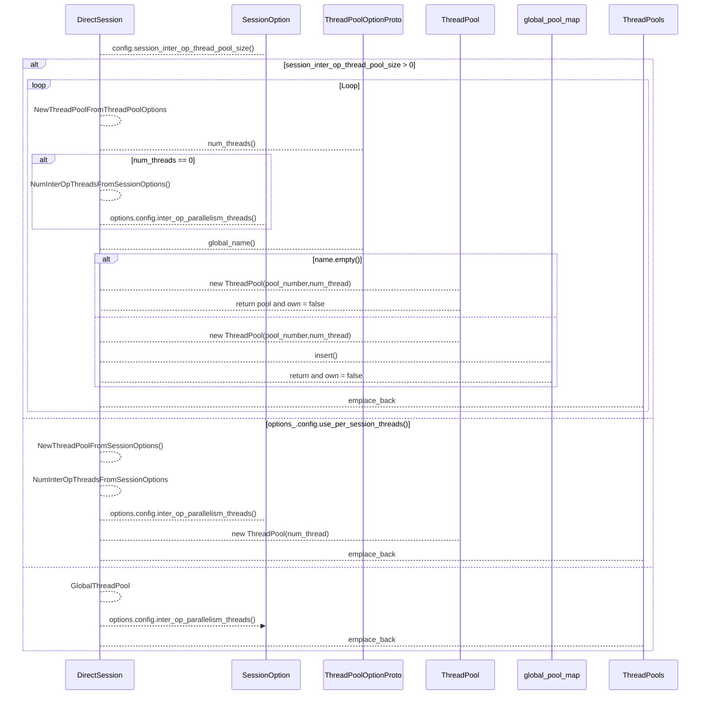
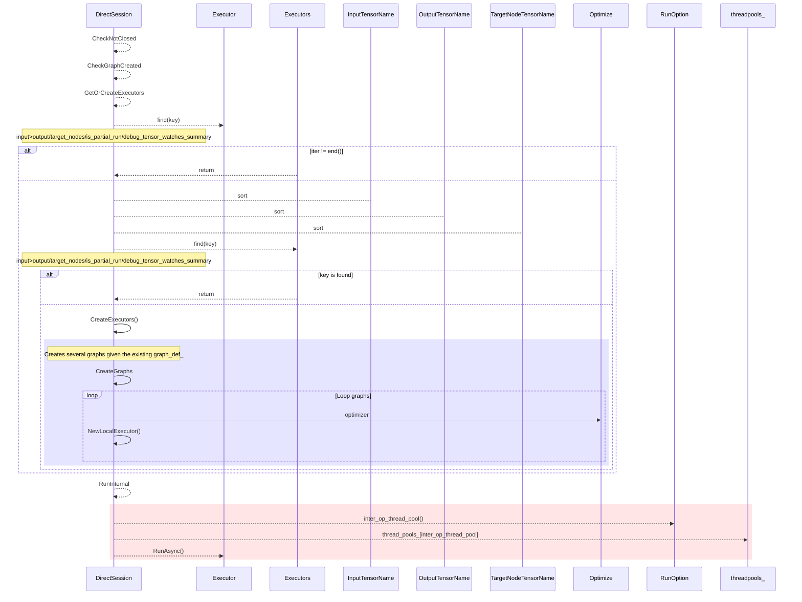

## DirectSession

根据《Tensorflow Session Factory源码解析》一文中的分析，Direct Session创建Session时，根据用户传递的SessionOptions不同，存在三种不同的线程池。本文主要对三种线程池的配置方式及创建流程进行说明。
 **注意：由于tensorflow版本不同，线程池的实现会有差异，本文档基于1.8版本源码进行分析**

链接：https://www.jianshu.com/p/e9fd4f0d6bd1

------

# 1. NewSession

direct_session.cc中对direct session factory中NewSession函数进行了实现，代码如下所示：


```c++
Session* NewSession(const SessionOptions& options) override {
    // Must do this before the CPU allocator is created.
    if (options.config.graph_options().build_cost_model() > 0) {
      EnableCPUAllocatorFullStats(true);
    }
    std::vector<Device*> devices;
    const Status s = DeviceFactory::AddDevices(
        options, "/job:localhost/replica:0/task:0", &devices);
    if (!s.ok()) {
      LOG(ERROR) << s;
      return nullptr;
    }

    DirectSession* session =
        new DirectSession(options, new DeviceMgr(devices), this);
    {
      mutex_lock l(sessions_lock_);
      sessions_.push_back(session);
    }
    return session;
  }
```

Tensorflow支持创建多个session，DirectSessionFactory通过sessions_进行维护。
 NewSession函数主要创建了DirectSession的对象，DirectSession构造函数中与线程池创建相关的代码如下：


```cpp
DirectSession::DirectSession(const SessionOptions& options,
                             const DeviceMgr* device_mgr,
                             DirectSessionFactory* const factory)
    : Session("direct"), options_(options),
      device_mgr_(device_mgr),
      factory_(factory),
      cancellation_manager_(new CancellationManager()),
      operation_timeout_in_ms_(options_.config.operation_timeout_in_ms()) {
  const int thread_pool_size =
      options_.config.session_inter_op_thread_pool_size();
  if (thread_pool_size > 0) {
    for (int i = 0; i < thread_pool_size; ++i) {
      thread::ThreadPool* pool = nullptr;
      bool owned = false;
      init_error_.Update(NewThreadPoolFromThreadPoolOptions(
          options_, options_.config.session_inter_op_thread_pool(i), i, &pool,
          &owned));
      thread_pools_.emplace_back(pool, owned);
    }
  } else if (options_.config.use_per_session_threads()) {
    thread_pools_.emplace_back(NewThreadPoolFromSessionOptions(options_),
                               false /* owned */);
  } else {
    thread_pools_.emplace_back(GlobalThreadPool(options), false /* owned */);
  }
}
```

可见三种不同的线程池创建方法，由以下两个配置决定：

- session_inter_op_thread_pool_size
- use_per_session_threads
   优先考虑session_inter_op_thread_pool_size，当配置的thread_pool_size >0时，创建thread_pool_size个线程池。否则判断use_per_session_threads，当配置为true时，根据SessionOptions创建当前Session的线程池。默认使用GlobalThreadPool。
   以下将三种线程池分别称为：
- Multi ThreadPool：对应session_thread_pool_size>0，单session拥有多个线程池
- Local ThreadPool：对应use_per_session_threads=true，每个session拥有独立的线程池
- Global ThreadPool：多个Session全局共享同一个线程池，由第一个session创建。

# 2.SessionConfig

------

ConfigProto在config.proto文件中定义，本文档着重记录与线程池相关的配置选项。

## 2.1 session_inter_op_thread_pool

------

ConfigProto中session_inter_op_thread_pool采用repeated关键字进行修饰，相当于std的vector，可以用来存放N个相同类型的内容。可以通过该option为同一个session创建多个大小不同的线程池。


```undefined
  repeated ThreadPoolOptionProto session_inter_op_thread_pool = 12;
```

根据代码中的注释，这个session_inter_op_thread_pool选项处于试验阶段，后续可能会被别的机制所替代。如果配置了这个选项，可以在Session Run时，通过RunOptions选择这个线程池进行使用（ If this is configured, then RunOptions for a Run call can select the thread pool to use）。推荐的使用场景为： when some session invocations need to run in a background pool limited to a small number of threads。

ThreadPoolOptionProto的定义如下，num_threads定义了线程池的大小，如果等于0时，系统会根据需要选择比如inter_op_num_threads。


```go
message ThreadPoolOptionProto {
  int32 num_threads = 1;
  string global_name = 2;
};
```

## 2.2 use_per_session_threads

------

该配置使得每个session拥有自己独立的线程池。
 **需要注意的是，这个配置选项已经过时了。当session_inter_op_thread_pool变量中只有一个元素时，实现的功能与use_per_session_threads等价。**

## 2.3 inter/intra_op_parallelism_threads_num

------

inter/intra_op_parallelism_threads_num两个配置参数是用户使用得比较多的，主要用来控制线程池的大小。其中inter_op_parallelism_num_threads配置是并行的op数量，可理解为线程池的数量，intra是执行op的最大线程数。
 当不配置或者配置为0时，tensorflow根据系统选择默认的参数，比如在tensorflow 1.8,中，当使能mkl时，inter_op默认配置为2，不使能时默认为物理核个数。
 **默认设置在不同的tensorflow版本中各不相同，建议通过源码或者官方文档进行double check**


```go
// The execution of an individual op (for some op types) can be
  // parallelized on a pool of intra_op_parallelism_threads.
  // 0 means the system picks an appropriate number.
  int32 intra_op_parallelism_threads = 2;
  // Nodes that perform blocking operations are enqueued on a pool of
  // inter_op_parallelism_threads available in each process.
  // 0 means the system picks an appropriate number.
  // Note that the first Session created in the process sets the
  // number of threads for all future sessions unless use_per_session_threads is
  // true or session_inter_op_thread_pool is configured.
  int32 inter_op_parallelism_threads = 5;
```

# 3. NewThreadPoolFromThreadPoolOptions

当配置了session_inter_op_thread_pool_size时，调用本函数完成线程池的创建。


```cpp
const int thread_pool_size =
      options_.config.session_inter_op_thread_pool_size();
  if (thread_pool_size > 0) {
    for (int i = 0; i < thread_pool_size; ++i) {
      thread::ThreadPool* pool = nullptr;
      bool owned = false;
      init_error_.Update(NewThreadPoolFromThreadPoolOptions(
          options_, options_.config.session_inter_op_thread_pool(i), i, &pool,
          &owned));
      thread_pools_.emplace_back(pool, owned);
    }
```

direct_session.cc中定义本函数，通过配置的thread_pool_options创建线程池的功能，输入参数包括：

- SessionOptions：创建session时传入的配置参数
- thread_pool_options：当前thread_pool的大小配置参数
- pool_number：或许称为pool_id更为合适？
- ThreadPool：预先申明的线程池，创建的线程池赋值给该参数
- owned：布尔变量，线程池是否为当前session私有，若没有配置global name，owned为true。


```cpp
Status NewThreadPoolFromThreadPoolOptions(
    const SessionOptions& options,
    const ThreadPoolOptionProto& thread_pool_options, int pool_number,
    thread::ThreadPool** pool, bool* owned) 
```

下面对函数具体实现进行分段说明。
 线程池大小由thread_pool_options中定义的num_threads决定。若num_threads=0时，调用NewThreadPoolFromSessionOptionss获取线程池大小，下一节详细分析。


```go
  int32 num_threads = thread_pool_options.num_threads();
  if (num_threads == 0) {
    num_threads = NumInterOpThreadsFromSessionOptions(options);
  }
```

通过判断是否设置global_name分别创建session-local或者Global named threadpool。
 当没有设置global name时，创建session-local线程池：


```php
  const string& name = thread_pool_options.global_name();
  if (name.empty()) {
    // Session-local threadpool.
    VLOG(1) << "Direct session inter op parallelism threads for pool "
            << pool_number << ": " << num_threads;
    *pool = new thread::ThreadPool(
        options.env, strings::StrCat("Compute", pool_number), num_threads);
    *owned = true;
    return Status::OK();
  }
```

当设置global_name时，首先判断global_pool_map中是否创建过该name对应的线程池，如果没有创建则根据num_threads进行创建。如果创建过，不会重新创建，如果当前的num_threads与已创建的global threadpool大小不一致会报错。


```cpp
  // Global, named threadpool.
  typedef std::pair<int32, thread::ThreadPool*> MapValue;
  static std::map<string, MapValue>* global_pool_map =
      new std::map<string, MapValue>;
  static mutex* mu = new mutex();
  mutex_lock l(*mu);
  MapValue* mvalue = &(*global_pool_map)[name];
  if (mvalue->second == nullptr) {
    mvalue->first = thread_pool_options.num_threads();
    mvalue->second = new thread::ThreadPool(
        options.env, strings::StrCat("Compute", pool_number), num_threads);
  } else {
    if (mvalue->first != thread_pool_options.num_threads()) {
      return errors::InvalidArgument(
          "Pool ", name,
          " configured previously with num_threads=", mvalue->first,
          "; cannot re-configure with num_threads=",
          thread_pool_options.num_threads());
    }
  }
  *owned = false;
  *pool = mvalue->second;
  return Status::OK();
}
```

# 4. NewThreadPoolFromSessionOptions

Global ThreadPool与Local ThreadPool都调用NewThreadPoolFromSessionOptions函数创建线程池，区别在于Global ThreadPool创建的线程池为static变量，全局共享。


```cpp
thread::ThreadPool* GlobalThreadPool(const SessionOptions& options) {
  static thread::ThreadPool* const thread_pool =
      NewThreadPoolFromSessionOptions(options);
  return thread_pool;
}
```


```cpp
 if (options_.config.use_per_session_threads()) {
    thread_pools_.emplace_back(NewThreadPoolFromSessionOptions(options_),
                               false /* owned */);
```

NewThreadPoolFromSessionOptions函数在process_util.cc中实现，代码路径为：
 tensorflow/core/common_runtime/process_util.cc。


```cpp
thread::ThreadPool* NewThreadPoolFromSessionOptions(
    const SessionOptions& options) {
  const int32 num_threads = NumInterOpThreadsFromSessionOptions(options);
  VLOG(1) << "Direct session inter op parallelism threads: " << num_threads;
  return new thread::ThreadPool(options.env, "Compute", num_threads);
}
```

## 4.1 NumInterOpthreadsFromSessionOptions()

本函数通过解析SessionOptions获取Inter_op_threads_num，存在以下几种不同的情况：

- 配置参数：SessionOptions中定义了inter_op_parallem_threads且不为0时
- 默认参数
  - 当使能mkl时，配置为CPU核数/omp_get_max_threads()上取整与2间的较大值。
  - 不是能mkl时，配置为有效的CPU核数，这里的CPU核数为物理核个数，通过以下代码获取:


```cpp
//path:tensorflow/core/platform/posix/port.cc
unsigned int count = std::thread::hardware_concurrency();
```

**注意：
 conda版本的tensorflow中默认使能mkl，pip版本的tensorflow默认没有使能mkl，用户从源代码编译可以通过配置相关编译选项选择是否使能mkl。
 此外如果用户不显示设置inter_op且使能mkl时，tensorflow会打印信息提示当前inter_op的设置值，也可辅助判断。**


```cpp
int32 NumInterOpThreadsFromSessionOptions(const SessionOptions& options) {
  const int32 inter_op = options.config.inter_op_parallelism_threads();
  if (inter_op != 0) return inter_op;
#ifdef INTEL_MKL
  // MKL library executes ops in parallel using OMP threads
  // Set inter_op conservatively to avoid thread oversubscription that could 
  // lead to severe perf degradations and OMP resource exhaustion
  const int mkl_intra_op = omp_get_max_threads();
  CHECK_GE(mkl_intra_op, 1);
  const int32 mkl_inter_op = std::max(
          (port::NumSchedulableCPUs() + mkl_intra_op - 1) / mkl_intra_op, 2);
  VLOG(0) << "Creating new thread pool with default inter op setting: "
          << mkl_inter_op
          << ". Tune using inter_op_parallelism_threads for best performance.";
  return mkl_inter_op;
#else
  // Default to using the number of cores available in the process.
  return port::NumSchedulableCPUs();
#endif
}
```

# 5. thread::ThreadPool

通过上述分析，direct Session中三种线程池最终都是通过构造thread::ThreadPool对象实现。ThreadPool类在tensorflow/core/lib/core/threadpool.h中定义，具体实现在tensorflow/core/lib/core/threadpool.cc中，本文档主要考虑其构造函数的实现，调度相关逻辑会在后续文档中详细说明。


```cpp
  ThreadPool(Env* env, const ThreadOptions& thread_options, const string& name,
             int num_threads, bool low_latency_hint);

  ThreadPool(Env* env, const string& name, int num_threads);

  ThreadPool(Env* env, const ThreadOptions& thread_options, const string& name,
             int num_threads);
```

三种构造函数接口实现如下：


```cpp
ThreadPool::ThreadPool(Env* env, const string& name, int num_threads)
    : ThreadPool(env, ThreadOptions(), name, num_threads, true) {}

ThreadPool::ThreadPool(Env* env, const ThreadOptions& thread_options,
                       const string& name, int num_threads)
    : ThreadPool(env, thread_options, name, num_threads, true) {}

ThreadPool::ThreadPool(Env* env, const ThreadOptions& thread_options,
                       const string& name, int num_threads,
                       bool low_latency_hint) {
  CHECK_GE(num_threads, 1);
  impl_.reset(new ThreadPool::Impl(env, thread_options, "tf_" + name,
                                   num_threads, low_latency_hint));
}
```

可见最终调用的是eigen的线程池实现。


```cpp
struct ThreadPool::Impl : Eigen::ThreadPoolTempl<EigenEnvironment> {
  Impl(Env* env, const ThreadOptions& thread_options, const string& name,
       int num_threads, bool low_latency_hint)
      : Eigen::ThreadPoolTempl<EigenEnvironment>(
            num_threads, low_latency_hint,
            EigenEnvironment(env, thread_options, name)) {
#ifdef TF_ENABLE_METRIC
    std::string tags = "name=" + name + " num=" + std::to_string(num_threads);
    taskMetric_ = getInstance()->registerMetric("ThreadPool.TaskNum",
                                                MetricType::AVG, tags);
    ratioMetric_ = getInstance()->registerMetric("ThreadPool.Run.Ratio",
                                                 MetricType::AVGRATIO, tags);
    maxRatioMetric_ = getInstance()->registerMetric("ThreadPool.Run.Ratio.Max",
                                                    MetricType::MAXRATIO, tags);
    stop_ = false;
    NoneMetric* p = dynamic_cast<NoneMetric*>(taskMetric_);
    if (p == nullptr) {  // p is realy metric
      thread_ = new std::thread(&ThreadPool::Impl::loopForReport, this);
    }
#endif
  }
```


### DirectSession构造函数[线程池创建逻辑]


+ inter_op_parallelism_threads

“Intra-op parallelism” (or

“within-op”) can be very helpful though, especially for computation-bound

operations like convolutions where different threads can feed off the same small

set of memory.

On mobile, how many threads an op will use is set to the number of cores by

default, or 2 when the number of cores can't be determined.


###  Run



