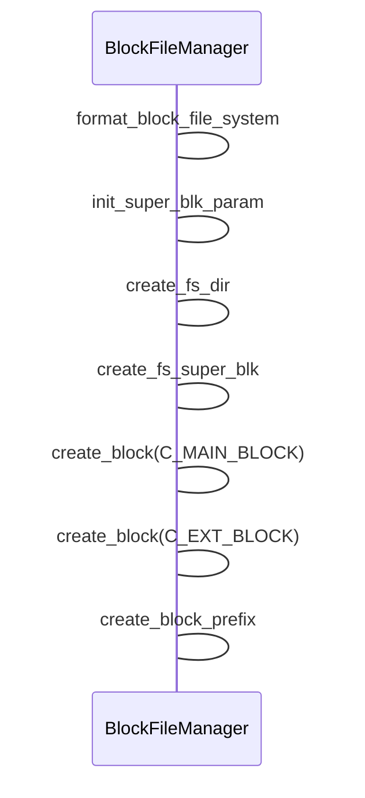

## Taobao FS

```mermaid
classDiagram
LogicBlock <-- DataHandle
DataHandle <-- LogicBlock
IndexHandle <-- LogicBlock
PhysicalBlock <-- LogicBlock
FileSystemParameter <-- BlockFileManager
LogicBlock <-- BlockFileManager
PhysicalBlock <-- BlockFileManager
SuperBlock <-- BlockFileManager
SuperBlockImp <-- BlockFileManager

class DataHandle {
+ read_segment_info()
+ write_segment_info()
+ read_segment_data()
+ write_segment_data()
+choose_physic_block()
}
class LogicBlock {
        uint32_t logic_block_id_; // logic block id
        int32_t avail_data_size_; // the data space of this logic block
        int32_t visit_count_;     // accumlating visit count
        time_t last_update_;      // last update time
        time_t last_abnorm_time_; // last abnormal time
        BlockStatus block_health_status; // block status info

        DataHandle* data_handle_;   // data operation handle
        IndexHandle* index_handle_; // associate index handle
        std::list<PhysicalBlock*> physical_block_list_; // the physical block list of this logic block
        common::RWLock rw_lock_;   // read-write lock
}
class BlockFileManager {
        typedef std::map<uint32_t, LogicBlock*> LogicBlockMap;
        typedef LogicBlockMap::iterator LogicBlockMapIter;
        typedef std::map<uint32_t, PhysicalBlock*> PhysicalBlockMap;
        typedef PhysicalBlockMap::iterator PhysicalBlockMapIter;

        LogicBlockMap logic_blocks_; // logic blocks
        LogicBlockMap compact_logic_blocks_; // compact logic blocks
        PhysicalBlockMap physical_blocks_;   // physical blocks

        int bit_map_size_;      // bitmap size
        BitMap* normal_bit_map_; // normal bitmap
        BitMap* error_bit_map_;  // error bitmap
        common::SuperBlock super_block_; // super block
        SuperBlockImpl* super_block_impl_; // super block implementation handle
        common::RWLock rw_lock_;           // read-write lock
        +get_instance()
int format_block_file_system(const common::FileSystemParameter& fs_param, const bool speedup = false);
        int clear_block_file_system(const common::FileSystemParameter& fs_param);
        int bootstrap(const common::FileSystemParameter& fs_param);

        int new_block(const uint32_t logic_block_id, uint32_t& physical_block_id, const BlockType block_type =
            C_MAIN_BLOCK);
        int new_ext_block(const uint32_t logic_block_id, const uint32_t physical_block_id,
            uint32_t& ext_physical_block_id, PhysicalBlock **tPhysicalBlock);
        int del_block(const uint32_t logic_block_id, const BlockType block_type = C_MAIN_BLOCK);

        LogicBlock* get_logic_block(const uint32_t logic_block_id, const BlockType block_type = C_MAIN_BLOCK);
        int get_all_logic_block(std::list<LogicBlock*>& logic_block_list, const BlockType block_type = C_MAIN_BLOCK);
        int get_all_block_info(std::set<common::BlockInfo>& blocks, const BlockType block_type = C_MAIN_BLOCK);
        int64_t get_all_logic_block_size(const BlockType block_type = C_MAIN_BLOCK);
        int get_logic_block_ids(common::VUINT& logic_block_ids, const BlockType block_type = C_MAIN_BLOCK);
        int get_all_physic_block(std::list<PhysicalBlock*>& physic_block_list);

        //status info
        int query_super_block(common::SuperBlock& super_block_info);
        int query_approx_block_count(int32_t& block_count) const;
        int query_bit_map(char** bit_map_buffer, int32_t& bit_map_len, int32_t& set_count, const BitMapType bitmap_type =
            C_ALLOCATE_BLOCK);
        int query_space(int64_t& used_bytes, int64_t& total_bytes) const;

        int load_super_blk(const common::FileSystemParameter& fs_param);

        int switch_compact_blk(const uint32_t block_id);
        int expire_compact_blk(const time_t time, std::set<uint32_t>& erase_blocks);

        int set_error_bitmap(const std::set<uint32_t>& error_blocks);
        int reset_error_bitmap(const std::set<uint32_t>& reset_error_blocks);
        int create_block_prefix();
        void clear_block_tmp_index(const char* mount_name);
        }
        
class SuperBlock {
      char mount_tag_[MAX_DEV_TAG_LEN]; // magic tag
      int32_t time_;                    // mount time
      char mount_point_[common::MAX_DEV_NAME_LEN]; // name of mount point
      int64_t mount_point_use_space_; // the max space of the mount point
      BaseFsType base_fs_type_; // ext4, ext3...

      int32_t superblock_reserve_offset_; // super block start offset. not used
      int32_t bitmap_start_offset_; // bitmap start offset

      int32_t avg_segment_size_; // avg file size in block file

      float block_type_ratio_; // block type ration
      int32_t main_block_count_; // total count of main block
      int32_t main_block_size_; // per size of main block

      int32_t extend_block_count_; // total count of ext block
      int32_t extend_block_size_; // per size of ext block

      int32_t used_block_count_; // used main block count
      int32_t used_extend_block_count_; // used ext block count

      float hash_slot_ratio_; // hash slot count / file count ratio
      int32_t hash_slot_size_; // number of hash bucket slot
      MMapOption mmap_option_; // mmap option
      int32_t version_; // version
      }
```

​    super block file implementation, inner format:

​    ------------------------------------------------------------------------------------------

​    |    not used     |     double superblock   |not used |  double normal  |  double error  |

​    |                 |                         |         |   bitmap        |  bitmap        |

​     ------------------------------------------------------------------------------------------

​    | reserver offset | SuperBlock | SuperBlock | int32_t | BitMap | BitMap | BitMap | BitMap|

------------------------------------------------------------------------------------------


### BlockFileManager



